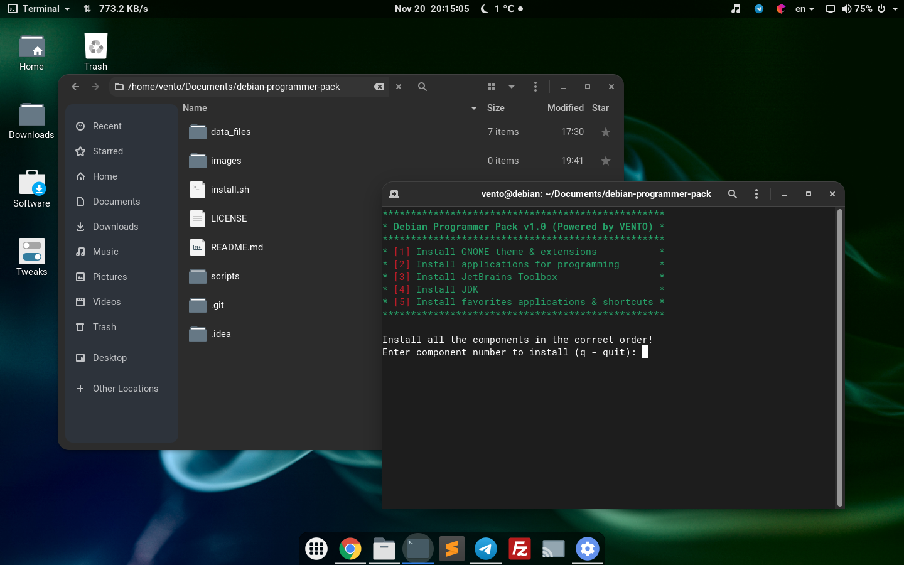
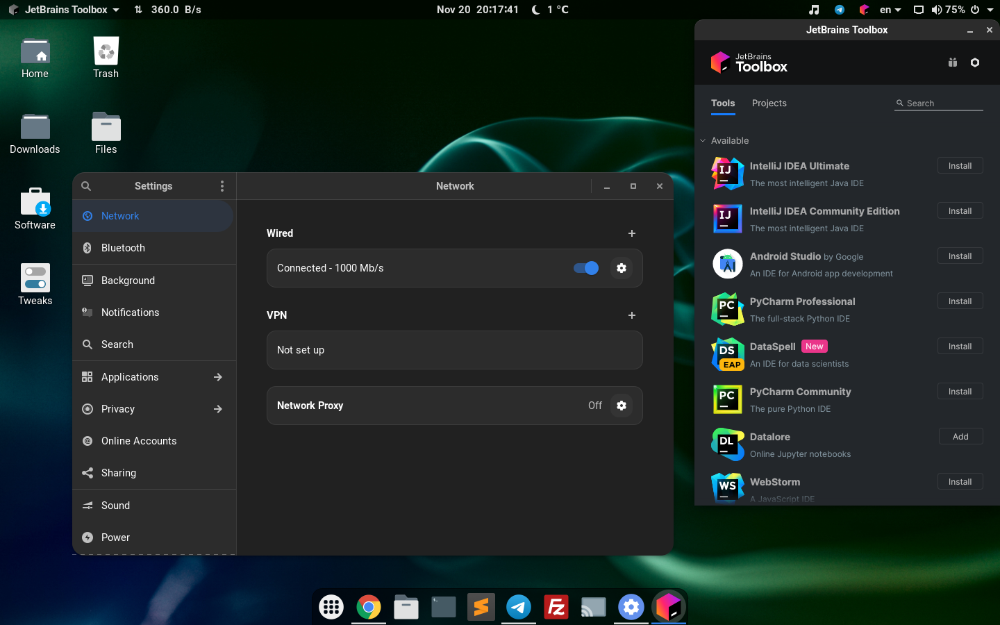
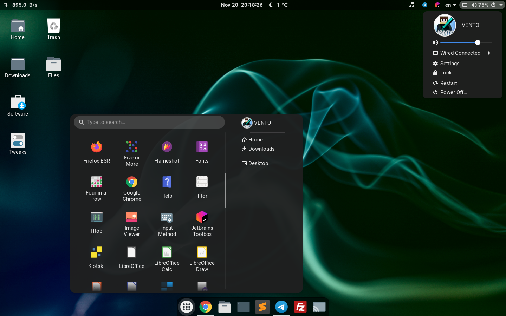

# Debian Programmer Pack v1.0

It's a pack that installs modern dark theme, useful extensions and coding apps for GNOME/GTK based desktop environments.

> Tested on Debian 11.

## Installation

Run the following command in the terminal:

```sh
./install.sh
```
The main menu will appear which allows installing different modules of this pack.

Just type the number of the component and press ENTER.
> WARNING: It's very important to install all the components in the correct order!

## Pack contents

### [1] GNOME theme & extensions

- Theme: [Orchis](https://github.com/vinceliuice/Orchis-theme)
- Fonts: [Roboto](https://fonts.google.com/specimen/Roboto)
- Icons: [Material-Originals](https://github.com/Macintosh98/Material-Originals-Icons)
- Extensions:
  - [AlternateTab](https://extensions.gnome.org/extension/15/alternatetab/) — Better Alt+Tab window
  - [AppIndicator and KStatusNotifierItem Support](https://extensions.gnome.org/extension/615/appindicator-support/) — Tray icons
  - [ArcMenu](https://extensions.gnome.org/extension/3628/arcmenu/) — Applications menu
  - [Big Avatar](https://extensions.gnome.org/extension/3488/big-avatar/) — User avatar and name in the menu panel
  - [Bring Out Submenu Of Power Off/Logout Button](https://extensions.gnome.org/extension/2917/bring-out-submenu-of-power-offlogout-button/) — Edit buttons in the menu panel
  - [Dash to Dock](https://extensions.gnome.org/extension/307/dash-to-dock/) — Dock for favorites applications
  - [Desktop Icons: Neo](https://extensions.gnome.org/extension/4337/desktop-icons-neo/) — Desktop icons
  - [Hide Activities Button](https://extensions.gnome.org/extension/744/hide-activities-button/) — Remove the 'Activities' button from the status bar
  - [Mpris Indicator Button](https://extensions.gnome.org/extension/1379/mpris-indicator-button/) — Music control in the system tray
  - [Net speed Simplified](https://extensions.gnome.org/extension/3724/net-speed-simplified/) — Connection speed in the system tray 
  - [NoAnnoyance](https://extensions.gnome.org/extension/1236/noannoyance/) — Disable the 'Window is ready' notification
  - [Removable Drive Menu](https://extensions.gnome.org/extension/7/removable-drive-menu/) — Access removable devices from tray
  - [Remove Alt+Tab Delay v2](https://extensions.gnome.org/extension/2741/remove-alttab-delay-v2/) — Remove the 0.15 second popup delay
  - [Sound percentage](https://extensions.gnome.org/extension/2120/sound-percentage/) — Current sound percentage in the system tray
  - [User Themes](https://extensions.gnome.org/extension/19/user-themes/) — Load shell themes
  - [Volume Scroll](https://extensions.gnome.org/extension/1420/volume-scroll/) — Change the audio volume while scrolling anywhere in the status bar
  - [Weather In The Clock](https://extensions.gnome.org/extension/1380/weather-in-the-clock/) — Current weather in the status bar
  - [Weeks Start on Monday Again...](https://extensions.gnome.org/extension/1720/weeks-start-on-monday-again/) — Monday is the first day of the week in calendar

### [2] Applications for programming

- [Snap Store](https://snapcraft.io/store) — Store to install and manage applications
- [Flameshot](https://flameshot.org/) — Powerful screenshot software
- [Google Chrome](https://www.google.com/intl/en/chrome/) — Web browser
- [Telegram Desktop](https://desktop.telegram.org/) — Telegram messenger
- [Sublime Text](https://www.sublimetext.com/) — Text editor
- [FileZilla](https://filezilla-project.org/) — FTP client application
- [Putty](https://www.chiark.greenend.org.uk/~sgtatham/putty/) — SSH and telnet client
- [Git](https://git-scm.com/) — Version control system

### [3] JetBrains Toolbox

- [Toolbox App](https://www.jetbrains.com/toolbox-app/) — Application to manage JetBrains tools easily

#### Instruction for resetting evaluation period in JetBrains products:
1. Open JetBrains IDE
2. Go to `File` 🠊 `Settings` 🠊 `Plugins`
3. Click on the `gears icon` 🠊 `Manage Plugin Repositories`
4. Add URL `https://plugins.zhile.io` and press `OK`
5. In the `Marketplace` search and install plugin `IDE Eval Reset`
6. Go to `Help` 🠊 `Eval Reset` 🠊 `Reset` 🠊 `Yes`
7. Restart the IDE

### [4] JDK

- [Java SE Development](https://www.oracle.com/java/technologies/downloads/) — Tools for developing, debugging, and monitoring Java applications

### [5] Favorites applications & shortcuts

- Adds Google Chrome, File Manager, Terminal, Sublime Text, Telegram Desktop, FileZilla, Putty to favorites applications.

## Screenshots



